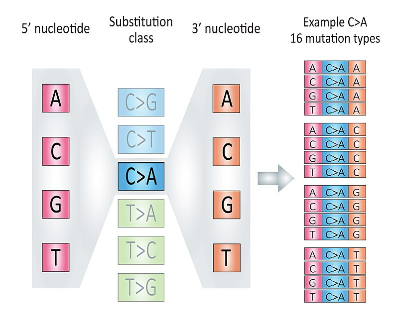

# (PART) Common Workflow  {-}

# COSMIC Signature Identification {#sbssig}

In this chapter, we will introduce how to identify COSMIC signatures from records of variant calling data.
The COSMIC signatures include three type of signatures: SBS, DBS and ID (short for INDEL).

The signature identification procedure has been divided into 3 steps:

1. Read mutation data.
2. Tally components: for SBS, it means classifying SBS records into 96 components (the most common case) and generate sample matrix.
3. Extract signatures: estimate signature number and identify signatures.

## Read Data 

> Make sure `library(sigminer)` before running the following code.

The input data should be in [VCF](https://www.ebi.ac.uk/training-beta/online/courses/human-genetic-variation-introduction/variant-identification-and-analysis/understanding-vcf-format/), [MAF](https://docs.gdc.cancer.gov/Data/File_Formats/MAF_Format/) format.

- For VCF, it can only be VCF file paths.
- For MAF, it can be either a MAF file or a `data.frame`. 

MAF format is the standard way to represent small-scale variants in Sigminer. There is a popular R/Bioconductor package [**maftools**](https://github.com/PoisonAlien/maftools) [@mayakonda2018maftools] for analyzing MAF data. It provides an R class **MAF** to represent MAF format data.

### VCF as input

If you use VCF files as input, you can use `read_vcf()` to read multiple VCF files as a `MAF` object.

```{r}
vcfs <- list.files(system.file("extdata", package = "sigminer"), "*.vcf", full.names = TRUE)
maf <- read_vcf(vcfs)
maf <- read_vcf(vcfs, keep_only_pass = FALSE)
```

### MAF as input

MAF format is the most recommended input, you can provides it either as a file or as a `data.frame`.

Typically, you can obtain the data in the following ways:

1. You get multiple VCF files and convert them into a MAF file ([vcf2maf](https://github.com/mskcc/vcf2maf) is the most used tool for conversion).
2. You get a MAF file from a reference or a public data portal, e.g., [cBioPortal](http://www.cbioportal.org/) or [GDC portal](https://portal.gdc.cancer.gov/).
3. You get a EXCEL file providing MAF-like data from a reference, you should read the data firstly (with `readxl::read_excel()`) and then construct a `data.frame` providing necessary columns.

Once a MAF file or a MAF-like `data.frame` is ready, you can read/convert it as a `MAF` object with `read_maf()`. Here TCGA LAML dataset is used as an example:

```{r}
laml.maf <- system.file("extdata", "tcga_laml.maf.gz", package = "maftools", mustWork = TRUE)
laml <- read_maf(maf = laml.maf)
laml
```

The `laml` is a `MAF` object. The `MAF` class is exported from **maftools** to **sigminer**. So `laml` can be directly use functions provided by **maftools**. 

As a `MAF` object, the mutation records are stored in slot `data` and `maf.silent`.

```{r}
head(laml@data)
head(laml@maf.silent)
```

The `data` slot contains non-silent variants, and the `maf.silent` slot contains silent variants.
Default uses Variant Classifications with High/Moderate variant consequences as non-silent variants. http://asia.ensembl.org/Help/Glossary?id=535: "Frame_Shift_Del", "Frame_Shift_Ins", "Splice_Site", "Translation_Start_Site","Nonsense_Mutation", "Nonstop_Mutation", "In_Frame_Del","In_Frame_Ins", "Missense_Mutation" (see `?read_maf`). If you want to change, please set `vc_nonSyn` option.


Other slots in `MAF` object are summary data either by sample or gene/variant type etc.

```{r}
slotNames(laml)
```

Acute myeloid leukemia is not a good object to study mutational signatures due to low mutation burden, we will use a subset of TCGA breast cohort as for illustration of the following analyses.

Anand Mayakonda has already stored whole TCGA mutation data as MAF objects in [**TCGAmutations**](https://github.com/PoisonAlien/TCGAmutations) package.
Here I will load the TCGA BRCA cohort and create a sub-cohort with 100 tumors.

```{r}
library(TCGAmutations)
knitr::kable(tcga_available())
```

```{r, eval=FALSE}
set.seed(1234)
brca <- tcga_load("BRCA")
brca <- maftools::subsetMaf(brca,
                            tsb = as.character(sample(brca@variants.per.sample$Tumor_Sample_Barcode, 100)))
saveRDS(brca, file = "data/brca.rds")
```

> Here we save this cohort to let user can also run the examples without installing package TCGAmutations.

```{r}
brca <- readRDS("data/brca.rds")
```

## Tally Components 

### The most common 96 components

According to 3-nucleotide context (mutated base, 5' and 3' adjacent bases) and base complementary pairing principle, we can divide all SBS mutations into 96 mutation types. We call each mutation type as a *component* here.

> This classification is based the six substitution subtypes: C>A, C>G, C>T, T>A, T>C, and T>G (all substitutions are referred to by the pyrimidine of the mutated Watson—Crick base pair). Further, each of the substitutions is examined by incorporating information on the bases immediately 5’ and 3’ to each mutated base generating 96 possible mutation types (6 types of substitution x 4 types of 5’ base x 4 types of 3’ base). 

```{r echo=FALSE, fig.cap="The illustration of 96 components, fig source: https://en.wikipedia.org/wiki/Mutational_signatures"}

```

We tally components in each sample, and generate a sample-by-component matrix.

```{r}
mt_tally <- sig_tally(
  brca,
  ref_genome = "BSgenome.Hsapiens.UCSC.hg19",
  useSyn = TRUE
)
```

> Here set `useSyn = TRUE` to include all variant records in MAF object to generate sample matrix.

```{r}
mt_tally$nmf_matrix[1:5, 1:5]
```

We use notion `left[ref>mut]right` to mark each component, e.g. `C[T>G]A` means a base T with 5' adjacent base C and 3' adjacent base A is mutated to base G.


### Other Situations

Above we show the most common SBS classifications, there are other situations supported by **sigminer**, including other classifications for SBS records and other mutation types (DBS and ID). All situations about SBS, DBS and ID signatures are well documented in [wiki of SigProfilerMatrixGenerator package](https://osf.io/s93d5/wiki/home/).

#### Other SBS classifications

After calling `sig_tally()`, the most used matrix is stored in `nmf_matrix`, and all matrices generated by **sigminer** are stored in `all_matrices`.

```{r}
str(mt_tally$all_matrices, max.level = 1)
```

If you add the strand classification, all matrices can be generated by **sigminer** will return.

```{r}
mt_tally2 <- sig_tally(
  brca,
  ref_genome = "BSgenome.Hsapiens.UCSC.hg19",
  useSyn = TRUE, add_trans_bias = TRUE
)

str(mt_tally2$all_matrices, max.level = 1)
```

#### DBS and ID components

If you want to generate DBS or ID matrices, just modify the `mode` option.

```{r}
mt_tally_DBS <- sig_tally(
  brca,
  ref_genome = "BSgenome.Hsapiens.UCSC.hg19",
  useSyn = TRUE, 
  mode = "DBS",
  add_trans_bias = TRUE
)

str(mt_tally_DBS$all_matrices, max.level = 1)
```

> Program will stop if no records to analyze.

Let's see ID records.

```{r}
mt_tally_ID <- sig_tally(
  brca,
  ref_genome = "BSgenome.Hsapiens.UCSC.hg19",
  useSyn = TRUE, 
  mode = "ID",
  add_trans_bias = TRUE
)

str(mt_tally_ID$all_matrices, max.level = 1)
```

#### Take togother

If you want to get all matrices for SBS, DBS and ID at the same time, you don't need to write a for loop or type three times to do this.
Just set `mode='ALL'`, **sigminer** will do it for you!

```{r}
mt_tally_all <- sig_tally(
  brca,
  ref_genome = "BSgenome.Hsapiens.UCSC.hg19",
  useSyn = TRUE, 
  mode = "ALL",
  add_trans_bias = TRUE
)

str(mt_tally_all, max.level = 1)
```

Please note, in this case, just a list containing matrices will return.

## Extract Signatures 

There are two different approaches can be used to implement signature extraction.

1. Semi-automatic way. Firstly estimate signature number and then extract signatures. This is the basic usage of [**NMF**](https://github.com/renozao/NMF) package [@gaujoux2010flexible]. Run multiple times of NMF in a range of signature number firstly and compute some measures to let you consider which signature number is suitable and then extract specified number of signatures again with NMF package.
2. Automatic way. This includes multiple implementations, and will be described in corresponding part.

### Method 1: Estimate Signature Number  

To estimate signature number, we firstly run NMF for multiple times and calculate some measures from the results, then select the best signature number based on the measure vs. signature number plot.

This is done by `sig_estimate()` function. Let's try signature number 2-6. For simplicity, we just run NMF twice for each signature number. We use 4 cores to speed up the computation.

```{r, eval=FALSE}
library(NMF)

mt_est <- sig_estimate(mt_tally$nmf_matrix,
                       range = 2:6,
                       nrun = 10, # increase this value if you wana a more stable estimation
                       use_random = FALSE,  # if TRUE, add results from randomized input
                       cores = 4,
                       pConstant = 1e-13,
                       verbose = TRUE)
```

```{r, include=FALSE}
load("data/mt_est.RData")
```

> `pConstant` option is set to avoid errors raised by **NMF** package.

We can show signature number survey for different measures by `show_sig_number_survey2()`.

```{r}
## You can also select the measures to show
## by 'what' option
show_sig_number_survey2(mt_est$survey)
```
> For the details of all the measures above, please read @gaujoux2010flexible and [vignette](https://cran.r-project.org/web/packages/NMF/vignettes/) of R package **NMF**.

The measures either provide stability (`cophenetic`) or how well can be reconstructed (`rss`).

Typically, measure **cophenetic** is used for determining the signature number. We can easily generate an elbow plot
with function `show_sig_number_survey()`.

```{r}
show_sig_number_survey(mt_est$survey, right_y = NULL)
```
> The most common approach is to use the cophenetic correlation coefficient. Brunet et al. suggested choosing the smallest value of r for which this coefficient starts decreasing. [@gaujoux2010flexible]

Cophenetic value (range from 0-1) indicates the robustness of consensus matrix clustering. In this situation, 3 is good. However, we can found that the cophenetic values are all >=0.9 from 2 to 5. So the more suitable way is considering both stability and reconstruction error at the same time, it can be easily done by `show_sig_number_survey()`.

```{r}
show_sig_number_survey(mt_est$survey)
```
> This function is very flexible, you can pick up any measure to the left/right axis. However, the default setting is the most recommended way.

We can see that we get a minimal RSS in signature number, and when this value goes from 5 to 6, the RSS increase! So we should not choose signature number more than 5 here because 6 is overfitting.

**NOTE**: There are no gold standard to determine the signature number. Sometimes, you should consider multiple measures. Remember, the most important thing is that **you should have a good biological explanation for each signature**.
The best solution in study may not be the best solution in math.

### Method 1: Extract Signatures 

After selecting a suitable signature number, now you can extract signatures. In general, use 30~50 NMF runs will get a robust result. 

Here we extract 5 signatures.

```{r, eval=FALSE}
mt_sig <- sig_extract(mt_tally$nmf_matrix, 
                      n_sig = 5,
                      nrun = 30,
                      cores = 4,
                      pConstant = 1e-13)
```

```{r, include=FALSE}
load("data/mt_sig.RData")
```


### Method 2: Auto-extraction

If you have no idea to select an optimal signature number from procedures above, you can try auto-extraction approaches provided by **sigminer**.

The latest version of **sigminer** provides two ways to auto-extract mutation signatures.

1. Auto-extract signatures by automatic relevance determination technique in non-negative matrix factorization [@tan2012automatic], the code is implemented by **SignatureAnalyzer** [@kim2016somatic] and exported to **sigminer**. This approach is known as bayesian NMF.
2. Auto-extract signatures by [SigProfiler](https://github.com/AlexandrovLab/SigProfilerExtractor), the gold-standard tool used for identifying signatures cataloged in COSMIC database. The technical details please read @alexandrov2020repertoire.

#### Method 2: bayesian NMF

In this approach, you need to set a maximum signature number (default is `25`) and run times to get the result. 10 for `nrun` here is okay, and more than 100 is not recommended.
The bayesian NMF will starts from a larger signature number and reduce it to a proper signature number to maximize posterior probability.

```{r, eval=FALSE}
mt_sig2 <- sig_auto_extract(mt_tally$nmf_matrix,
                            K0 = 10, nrun = 10,
                            strategy = "stable")
```

```{r, include=FALSE}
load("data/mt_sig2.RData")
```

Here the program uses **'robust' strategy** to return the result (see `strategy` option). It means that if you run 10 times and 6 of them return `4` signatures, then the optimal result with `4` signatures will be returned.

The info of each run can be given as:

```{r}
knitr::kable(mt_sig2$Raw$summary_run)
```

The `mt_sig2` has similar structure as `mut_sig`.

## Match Signatures  

After extracting signatures, we need to know their etiologies. This can be done by comparing the identified signatures and reference signatures from COSMIC database.

```{r}
sim <- get_sig_similarity(mt_sig2)
```

The result object `sim` is a list.

```{r}
str(sim)
```


From the result we can see that three signatures are properly matched to COSMIC reference signatures. If you find unknown signatures in your study, you should explore the etiologies by other analyses and even experiments.

The similarity matrix can be plotted.

```{r}
pheatmap::pheatmap(sim$similarity)
```

You can also try the COSMIC signature database V3 with:

```{r}
sim_v3 <- get_sig_similarity(mt_sig2, sig_db = "SBS")
```

## Operate `Signature` 

The result of `sig_extract()` or `sig_auto_extract()` is a `list` with `Signature` class. You can use `$` or use operation function to obtain the data stored in it.

To get the signature matrix:

```{r}
# Or mt_sig2$Signature
sig_signature(mt_sig2)[1:5, ]
```

To get signature exposure matrix:

```{r}
# Or mt_sig$Exposure
sig_exposure(mt_sig2)[, 1:5]
```

`get_sig_exposure()` may be more useful, it can be used to return a `data.frame` and set an exposure threshold.


```{r}
get_sig_exposure(mt_sig2)
```


For plotting signature profile and exposure profile, please go to chapter \@ref(sigobject).

For optimizing signature exposure, please use `sig_fit()`.

