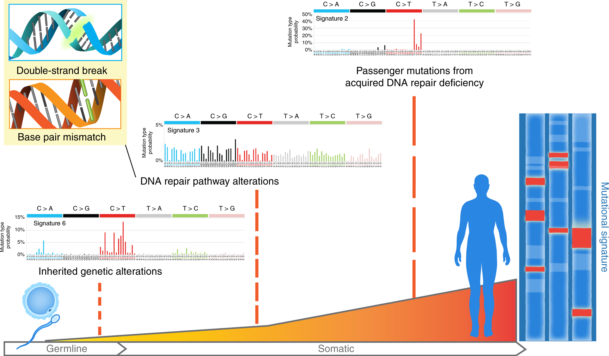

--- 
title: "Sigminer: A Scalable Toolkit to Extract, Analyze and Visualize Mutational Signatures"
author:
  - Shixiang Wang, ShanghaiTech University
  - Xue-Song Liu, ShanghaiTech University
date: "last revised on `r Sys.Date()`"
site: bookdown::bookdown_site
documentclass: book
bibliography: [ref.bib, packages.bib]
biblio-style: apalike
colorlinks: yes
link-citations: yes
description: "This package helps users to extract, analyze and visualize signatures from genomic variation records, thus providing new insight into cancer study."
github-repo: ShixiangWang/sigminer-doc
---

```{r set_root, include=FALSE, cache=FALSE}
knitr::opts_knit$set(root.dir = rprojroot::find_rstudio_root_file())
knitr::knit_hooks$set(debug = function(before, options, envir) {
  if (!before) {
    envir = as.list(envir)
    message("Objects: ", paste(names(envir), collapse = " "))
    for (i in names(envir)) {
      if (!startsWith(i, ".")) {
        message(
          i, " = ", envir[[i]]
        )
      }
    }
  }
})
```

# Introduction {#intro}

Underlying cancer hallmarks are genome instability, which generates the genetic diversity that expedites their acquisition, and inflammation, which fosters multiple hallmark functions [@hanahanHallmarksCancerNext2011]. Cancer genomes typically harbors more than 1,000 mutations in small (e.g., point mutations, short insertions and deletions) and large scale (e.g., copy number variations, rearrangements). Genomic contexts where mutation may accumulate in response to both endogenous processes and exogeneous exposures. In recent years, computational approaches (typically non-negative matrix factorization (NMF)) have been applied to the mutation catalog analysis of human/mouse tumors to detect characteristic mutational patterns, also known as **"mutational signatures"**.

## Biological Significance of Mutational Signature

To illustrate the biological significance of mutational signatures, we show some
well organized figures here.

```{r echo=FALSE, fig.cap="The illustration of SBS signature, fig source: https://www.nature.com/articles/nrg3729", out.width="80%", fig.width=10}
knitr::include_graphics("fig/sbs_signature_overview_nat_review2.png")
```

```{r echo=FALSE, fig.cap="The illustration of SBS signature (2), fig source: https://www.nature.com/articles/s41467-018-05228-y"}

```

SBS (short for single base substitution) signature is a famous type of mutational signature. SBS signatures are well studied and related to single-strand changes, typically caused by defective DNA repair.
Common etiologies contain aging, defective DNA mismatch repair, smoking, ultraviolet light exposure and [APOBEC](https://en.wikipedia.org/wiki/APOBEC).

Currently, all SBS signatures are summarized in COSMIC database, including two versions: [v2](https://cancer.sanger.ac.uk/cosmic/signatures_v2) and [v3](https://cancer.sanger.ac.uk/cosmic/signatures/SBS/).

Recently, @alexandrov2020repertoire extends the concept of mutational signature to three types of alteration: SBS, DBS (short for doublet base substitution) and INDEL (short for short insertion and deletion).
All reported common signatures are recorded in COSMIC (https://cancer.sanger.ac.uk/cosmic/signatures/), so we usually call them **COSMIC signatures**.


```{r echo=FALSE, fig.cap="The illustration of copy number signatures, fig source: https://www.nature.com/articles/s41588-018-0212-y"}
knitr::include_graphics("fig/cn_signature_overview.png")
```

Copy number signatures are less studied and many works are still to be done. The introduction is described in Chapter \@ref(cnsig).

> Genome rearrangement signatures are limited to whole genome sequencing data and also less studied, the implementation is not available in current version of Sigminer. We are happy to accept a PR if you are interested in create an extension function to Sigminer.

More details about mutational signatures you can read the [wiki page](https://en.wikipedia.org/wiki/Mutational_signatures).

## Sigminer

Here, we present an easy-to-use and scalable toolkit for mutational signature analysis and visualization in R. We named it **sigminer** (`signature` + `miner`). 
This tool can help users to extract, analyze and visualize signatures from genomic alteration records,
thus providing new insight into cancer study.

Currently, **sigminer** supports four types of signature:

- SBS signature in the form of 96 (6, 24, 384, 1536 and 6144) components.
- DBS signature in the form of 78 (186) components.
- ID (INDEL) signature in the form of 83 (28) components.
- Copy number signature by the method either from @macintyre2018copy or from our group work [@WangSX2020].

> Component here refer to a classification for a record (e.g. a mutation), in some papers mutation type or just type means the same thing. We use 'component' to represent a more broad concept.

## Installation 

The stable release version of **sigminer** package can be installed from the CRAN:

```{r, eval=FALSE}
install.packages("sigminer", dependencies = TRUE)
# Or
BiocManager::install("sigminer", dependencies = TRUE)
```

> Set `dependencies = TRUE` is recommended because many packages are required for full features in **sigminer**.

The development version of **sigminer** package can be installed from Github:

```{r eval=FALSE}
# install.packages("remotes")
remotes::install_github("ShixiangWang/sigminer", dependencies = TRUE)
```


## Issues or Suggestions  

Any issue or suggestion can be posted on [GitHub issue](https://github.com/ShixiangWang/sigminer/issues), we will reply ASAP.

Any pull requrest is welcome.

## Preparation 

To reproduce the examples shown in this manual, users should load the following packages firstly.
**sigminer** is requred to have version >= 1.0.0.

```{r}
library(sigminer)
library(NMF)
```

Current manual uses **sigminer** `r packageVersion("sigminer")`. More info about **sigminer** can be given as: 

```{r}
hello()
```


## Overview of Contents

The contents of this manual have been divided into 4 sections:

- Common workflow.
  - *de novo* signature discovery.
  - single sample exposure quantification.
  - subtype prediction.
- Target visualization.
  - copy number profile.
  - copy number distribution.
  - catalogue profile.
  - signature profile.
  - exposure profile.
  - ...
- Universal analysis.
  - association analysis.
  - group analysis.
- Other utilities.

**All functions are well organized and documented at <https://shixiangwang.github.io/sigminer/reference/index.html> (For Chinese users, you can also read it at <https://shixiangwang.gitee.io/sigminer/reference/index.html>). For usage of a specific function fun, run `?fun` in your R console to see its documentation.**

## Citation and LICENSE  

```{r}
citation("sigminer")
```


***

The software is made available for non commercial research purposes only
under the [MIT](https://github.com/ShixiangWang/sigminer/blob/master/LICENSE.md). However, notwithstanding any provision of
the MIT License, the software currently may not be used for commercial
purposes without explicit written permission after contacting Shixiang
Wang <wangshx@shanghaitech.edu.cn> or Xue-Song Liu
<liuxs@shanghaitech.edu.cn>.

MIT © 2019-2020 Shixiang Wang, Xue-Song Liu

MIT © 2018 Geoffrey Macintyre

MIT © 2018 Anand Mayakonda

-----

**[Cancer Biology Group](https://github.com/XSLiuLab) \@ShanghaiTech**

**Research group led by Xue-Song Liu in ShanghaiTech University**


```{r include=FALSE}
# automatically create a bib database for R packages
knitr::write_bib(c(
  .packages(), 'bookdown', 'knitr', 'rmarkdown'
), 'packages.bib')
```
