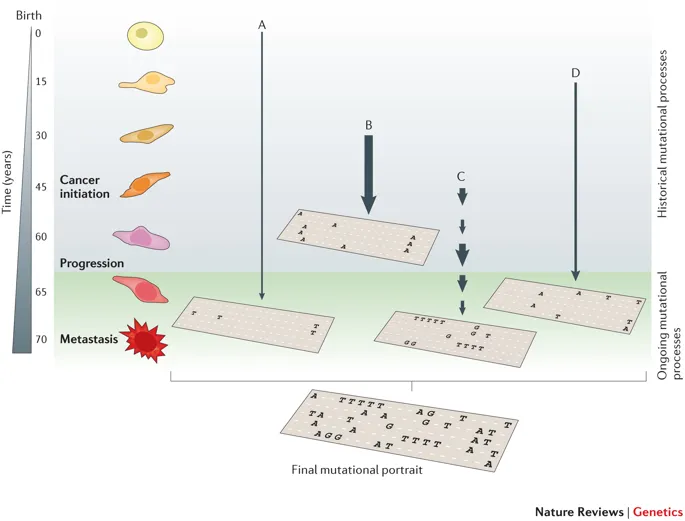

--- 
title: "sigminer: Genomic Alteration Signature Analysis in R"
author:
  - Shixiang Wang, ShanghaiTech University
  - Xue-Song Liu, ShanghaiTech University
date: "last revised on `r Sys.Date()`"
site: bookdown::bookdown_site
documentclass: book
bibliography: [ref.bib, packages.bib]
biblio-style: apalike
colorlinks: yes
link-citations: yes
description: "This package helps users to extract, analyze and visualize signatures from genomic variation records, thus providing new insight into cancer study."
github-repo: ShixiangWang/sigminer-doc
---

# Introduction {-}

Genomic alterations including single nucleotide substitution (SBS),
copy number alteration (CNA), etc. are the major force for cancer
initialization and development. Due to the specificity of molecular
lesions caused by genomic alterations, we can generate characteristic
alteration spectra, called 'signature'. 

To illustrate the biological significance of genome alteration signatures, we show some
well organized figures here.

```{r echo=FALSE, fig.cap="The illustration of SBS signature, fig source: https://www.nature.com/articles/nrg3729"}

```

```{r echo=FALSE, fig.cap="The illustration of SBS signature (2), fig source: https://www.nature.com/articles/s41467-018-05228-y"}
knitr::include_graphics("fig/sbs_signature_overview.png")
```

SBS signature is previously known as mutational signature. SBS signatures are well studied and related to single-strand changes, typically caused by defective DNA repair.
Common etiologies contain aging, defective DNA mismatch repair, smoking, ultraviolet light exposure and APOBOE.

Currently, all SBS signatures are summarized in COSMIC database, including two versions: [v2](https://cancer.sanger.ac.uk/cosmic/signatures_v2) and [v3](https://cancer.sanger.ac.uk/cosmic/signatures/SBS/).

> Recently, @alexandrov2020repertoire extends the concept of mutational signature to three types of mutation: SBS, DBS and INDEL. Here, we use genomic alteration signature to refer any kind of mutation type can be used to generate signature.


```{r echo=FALSE, fig.cap="The illustration of copy number signatures, fig source: https://www.nature.com/articles/s41588-018-0212-y"}
knitr::include_graphics("fig/cn_signature_overview.png")
```

Copy number signatures are less studied and many works are still to be done.


To study signatures, we created an easy-to-use and scalable toolkit for genomic alteration signature analysis and visualization in R. We named it **sigminer** (`signature` + `miner`). 
This tool can help users to extract, analyze and visualize signatures from genomic alteration records,
thus providing new insight into cancer study.

Currently, **sigminer** supports two types of signature:

- SBS signature in the form of 96 components
- Copy number signature by the method either from @macintyre2018copy or from our group work.


## Installation {-}

The **sigminer** package can be installed from ~~CRAN or~~ Github:

```{r eval=FALSE}
remotes::install_github("ShixiangWang/sigminer")
```


## Issues or Suggestions  {-}

Any issue can be posted on [GitHub issue](https://github.com/ShixiangWang/sigminer/issues), we will reply ASAP.

We have plans to extend other mutational signatures (like INDEL and DBS) to **sigminer** or 
extend reading input from other softwares, contribution is welcome.


## Preparation {-}

To reproduce the examples shown in this manual, users should load the following packages firstly.
**sigminer** is requred to have version >= 1.0.0.

```{r}
library(sigminer)
library(NMF)
```

Current manual uses **sigminer** `r packageVersion("sigminer")`. More info about **sigminer** can be given as: 

```{r}
hello()
```


## Citation and LICENSE  {-}

If you use **sigminer** in academic field, please cite our work:

***Copy number signature analyses in prostate cancer reveal distinct etiologies and clinical outcomes, under submission***

***

The software is made available for non commercial research purposes only
under the [MIT](https://github.com/ShixiangWang/sigminer/blob/master/LICENSE.md). However, notwithstanding any provision of
the MIT License, the software currently may not be used for commercial
purposes without explicit written permission after contacting Shixiang
Wang <wangshx@shanghaitech.edu.cn> or Xue-Song Liu
<liuxs@shanghaitech.edu.cn>.

MIT © 2019-2020 Shixiang Wang, Xue-Song Liu

MIT © 2018 Geoffrey Macintyre

MIT © 2018 Anand Mayakonda

-----

**[Cancer Biology Group](https://github.com/XSLiuLab) \@ShanghaiTech**

**Research group led by Xue-Song Liu in ShanghaiTech University**


```{r include=FALSE}
# automatically create a bib database for R packages
knitr::write_bib(c(
  .packages(), 'bookdown', 'knitr', 'rmarkdown'
), 'packages.bib')
```
